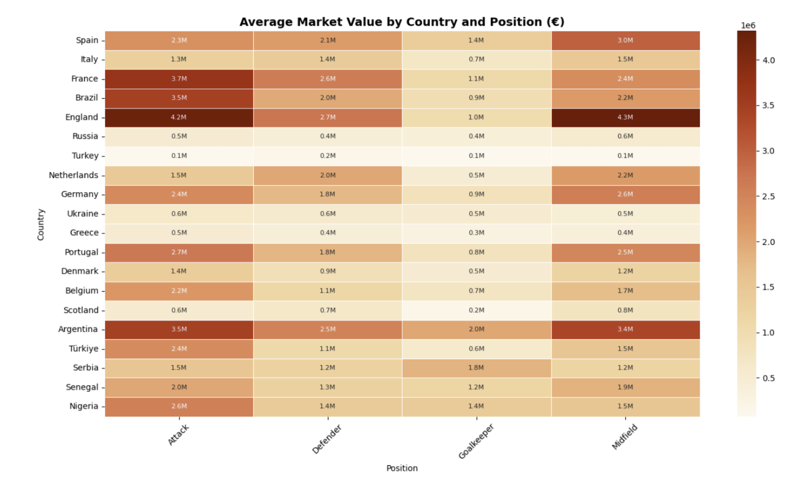
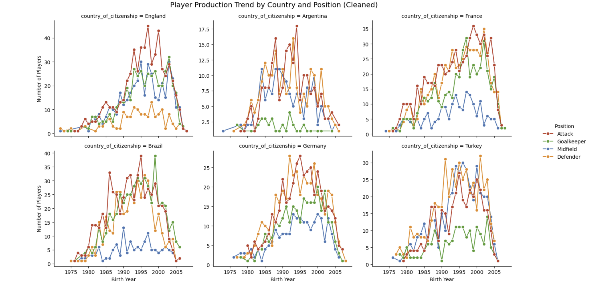
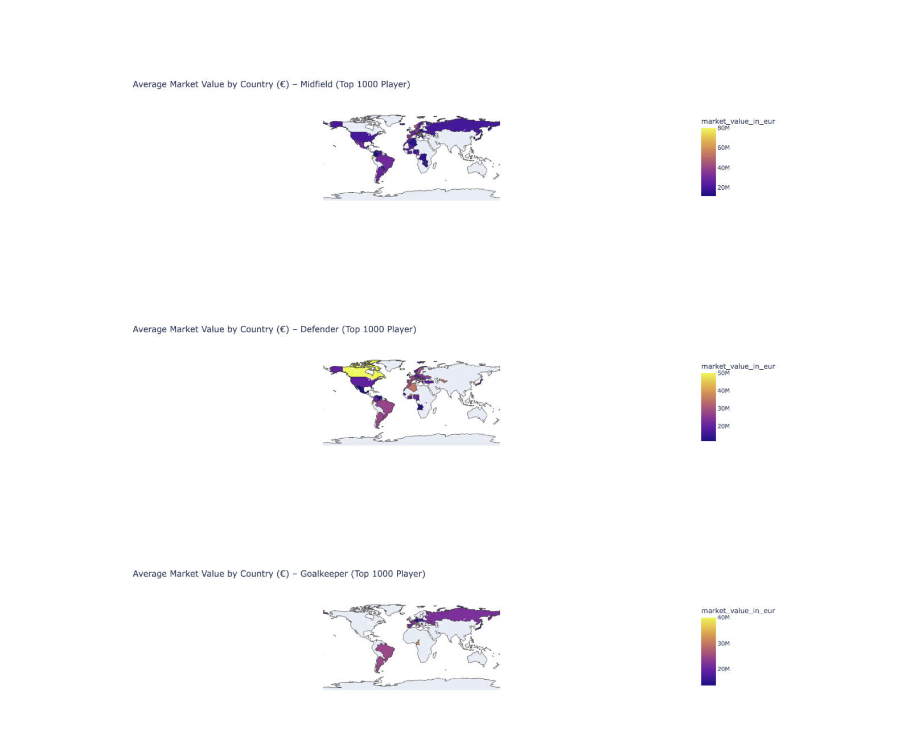

<div style="text-align: center;">
  
</div>


#  Soccer Analytics: Country & Position Analysis

Welcome to my data analysis project where I explored how different countries perform in various football positions based on player count and market value. Using Python and visualization libraries like **Matplotlib**, **Seaborn**, and **Plotly**, I created several charts to extract interesting insights from the dataset.

---

## 1️. Number of Players by Country and Position

To begin, I calculated how many players each country has in different positions: Goalkeeper, Defender, Midfielder, and Attacker.

```python
filtered_players = players.dropna(subset=['country_of_citizenship', 'position'])

position_matrix = (
    filtered_players
    .groupby(['country_of_citizenship', 'position'])
    .size()
    .reset_index(name='player_count')
    .pivot(index='country_of_citizenship', columns='position', values='player_count')
    .fillna(0)
    .astype(int)
)
```
## 2️. Average Market Value by Country and Position (€)
Then, I analyzed the average player market value per position per country. This reveals not just how many players exist, but how valuable they are.

```python
value_matrix = (
    filtered_players
    .groupby(['country_of_citizenship', 'position'])['market_value_in_eur']
    .mean()
    .reset_index()
    .pivot(index='country_of_citizenship', columns='position', values='market_value_in_eur')
    .fillna(0)
)
```
<div style="text-align: center;">  </div>

 Insights:

England leads in Attack, Defence, and Midfield.

Argentina has top Goalkeepers.

Turkey is only above average in Midfield.


## 3️. Player Production Trends Over Time
Using birth year data, I explored how player production by position evolved for countries like Brazil, England, Turkey, and France.

```python
players_cleaned['birth_year'] = pd.to_datetime(players_cleaned['date_of_birth'], errors='coerce').dt.year

trend_by_country_position = (
    players_cleaned[players_cleaned['country_of_citizenship'].isin(selected_countries)]
    .groupby(['birth_year', 'country_of_citizenship', 'position'])
    .size()
    .reset_index(name='player_count')
)
```
<div style="text-align: center;">  </div>
 Notable Observations:

Brazil consistently produces many attackers.

Germany excels in Defenders and Goalkeepers after 1990.

Turkey has unstable trends with Midfielders being the strongest.


## 4️. Top 1000 Players by Market Value – Country Mapping 
I also visualized the top 1000 most valuable players to understand global trends in football wealth.

```python
top_1000 = filtered_players.sort_values('market_value_in_eur', ascending=False).head(1000)

top1000_country_position_value = (
    top_1000
    .groupby(['country_of_citizenship', 'position'])['market_value_in_eur']
    .mean()
    .reset_index()
)
```

<div style="text-align: center;">  </div>
 Highlights:

Brazil dominates in Attack.

France and England are top for Defence and Midfield.

Senegal and some African nations show hidden talent.


 [GitHub Repository](https://github.com/emirdogann/football-analytics)
